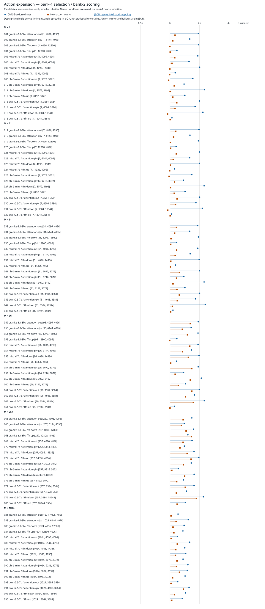

# HeliosTune

HeliosTune is my small GPU matrix-multiplication tuning experiment.

**Question:** is the search policy the problem, or is its kernel bank too limited? I added ten Hopper-aware actions: larger tiles, deeper pipelines, persistent TMA and tensor-core split-K. The persistent path builds on [Triton's pinned tutorial](https://github.com/triton-lang/triton/blob/v3.4.0/python/tutorials/09-persistent-matmul.py); my split-K path is in [`action_expansion.py`](src/heliostune/action_expansion.py).

**New H100 result:** bank-1-selected new actions beat `torch.matmul` on **9/96 named workloads**, versus **0/96** for the original 36 actions. There is **one exact median tie and 86 losses**. The new bank improves on the old bank on **95/96**, but torch still wins most workloads. These are descriptive medians, not significance claims. [Full summary](results/action-expansion-summary.json).

## What changed

I committed the [fixed action set and analysis plan](docs/action-expansion-plan.md) at [`adf5eb4`](https://github.com/mottopanikeiku/heliostune/commit/adf5eb4a854f8fd37ea888280861bead9024df77) before collecting data. Six new configurations apply everywhere; four split-K configurations apply only at M=1,7,31. Split-K computes FP32 partial tiles and reduces them in a second Triton kernel, converting once to FP16. Allocation, workspace and both launches are timed—not just the partial kernel.

I remeasured all **96 workloads / 84 unique shapes** on one H100. Bank 1 selects the lowest valid median separately from the old and new sets; bank 2 scores only those fixed winners and same-session torch. No scoring-bank minimum chooses an action. The expanded union also chooses old versus new on bank 1. [`Collector`](modal_action_expansion.py), [`CPU manifest`](src/heliostune/action_configs.py), [`raw measurements`](results/action-expansion-raw.json).

| Bank-2 result | Old 36 | New actions | Expanded union |
|---|---:|---:|---:|
| Wins against torch | 0 | 9 | 9 |
| Exact ties | 0 | 1 | 1 |
| Geometric-mean latency / torch | 1.608227 | 1.174062 | 1.173017 |

The geometric mean of **new / old latency is 0.730035**, a **27.0% reduction**. All **4,608 measurement rows** passed their numerical and timing checks; no candidate failed. [Definitions and per-workload records](results/action-expansion-summary.json).

## Where Triton beats torch

Ratio means **new / torch**; lower is better. These are all nine nominal wins from the [summary](results/action-expansion-summary.json). Five margins are below 1%; none is a statistical-significance claim.

| Model / projection | (M,N,K) | New / torch (µs) | Ratio |
|---|---|---:|---:|
| Granite / FFN-down | (1,4096,12800) | 52.928 / 53.056 | 0.997587 |
| Mistral / FFN-down | (1,4096,14336) | 56.768 / 56.992 | 0.996070 |
| Mistral / FFN-up | (1,14336,4096) | 53.952 / 54.336 | 0.992933 |
| Phi / attention-out | (1,3072,3072) | 17.664 / 18.272 | 0.966725 |
| Qwen / FFN-down | (1,3584,18944) | 63.456 / 67.184 | 0.944511 |
| Mistral / FFN-up | (7,14336,4096) | 54.560 / 54.944 | 0.993011 |
| Phi / attention-out | (7,3072,3072) | 18.048 / 18.432 | 0.979167 |
| Qwen / FFN-down | (7,3584,18944) | 64.256 / 67.712 | 0.948960 |
| Granite / FFN-up | (96,12800,4096) | 51.712 / 52.032 | 0.993850 |

Six wins use split-K; three use larger ordinary tiles; none uses persistent TMA. The largest saving is **5.55%** on Qwen's M=1 FFN-down. No selected new action beats torch at M=31,257,1024.



## Reproduce

```sh
uv sync --python 3.13 --locked --extra dev --extra modal
uv run python scripts/analyze_action_expansion.py
uv run python scripts/build_modal_wheel.py && uv run modal run modal_action_expansion.py
```

The second command regenerates the summary and figure on CPU. The third starts or resumes an H100 collection from a clean commit; completed workload units are reused. `--pilot` measures four workloads separately. [Fresh-repeat instructions](CONTRIBUTING.md). I used Torch 2.8.0 / Triton 3.4.0, FP16 allocating calls, 25 ms warmup / 100 ms timing, and p20/median/p80. The [cost estimate](results/action-expansion-cost.json) is **$2.0655**, including a failed startup, pilot and full run—not a provider invoice.

## Limits and history

- One H100 collection, not a device-replication study. Repeated shapes are not independent devices.
- Quantiles describe spread, not confidence intervals; individual timing samples are not retained.
- The FP32-output reference uses FP16 inputs with TF32 disabled. Passing atol=rtol=0.01 does not prove identical arithmetic; torch's reduced-FP16 reduction flag was enabled and recorded.
- Warmed medians omit compilation, acquisition and serving cost. I did not rerun transfer policies on the expanded bank.
- Ten new actions do not establish a hardware optimum or exhaust all possible Triton kernels.

The [earlier audit](results/action-set-audit.json) remains unchanged. The [original transfer comparison](results/tuner-comparison.md) favored cold Thompson over Parhelion; selected posterior transfer strengths were zero. Retrieval and posterior code remain in [`retrieval.py`](src/heliostune/retrieval.py) and [`bandit.py`](src/heliostune/bandit.py). [Next comparison](docs/NEXT.md).

I build on [AutoTVM](https://arxiv.org/abs/1805.08166), [linear Thompson sampling](https://proceedings.mlr.press/v28/agrawal13.html), [RGPE](https://arxiv.org/abs/1802.02219) and [Transfer-Tuning](https://arxiv.org/abs/2201.05587). MIT [license](LICENSE).

Written with AI coding assistance.
