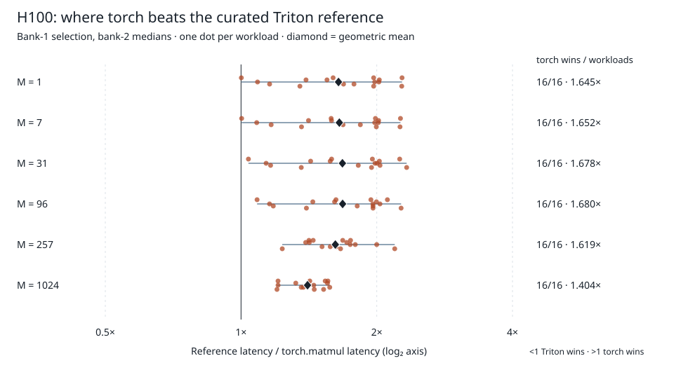

# HeliosTune

HeliosTune is my small GPU matrix-multiplication tuning experiment using nearby-shape retrieval and Bayesian linear Thompson sampling.

**Result: the action set is the larger problem.** I audited the existing H100 measurements: `torch.matmul` has lower stored median latency on **all 96 workloads, covering 84 unique matrix shapes**, even against the fastest of the **36 Triton configurations** on the scoring bank. Against the independently selected reference, its geometric-mean advantage is **1.610016×**, with a **18.304 µs median saving**. These are descriptions of old measurements, not new GPU timings or significance claims. [Audit numbers and definitions](results/action-set-audit.json).

**Question:** can measurements from other GPU models reduce target-GPU probes? This audit asks whether a better search over existing actions could erase the measured library gap.

## Where torch wins

I select the reference using bank 1 and score it and torch on bank 2. The ratio is **reference latency / torch latency**; above one favors torch. The denominator is a curated reference, not a hardware ceiling. Each row below contains the same number of workloads; repeated shapes across models are not independent devices. All numbers come from [`by_m` in the audit JSON](results/action-set-audit.json).

| M in A[M,K] @ B[K,N] | Torch wins / workloads | Geometric-mean ratio | Median saving (µs) |
|---:|---:|---:|---:|
| 1 | 16 / 16 | 1.644996 | 17.120 |
| 7 | 16 / 16 | 1.652062 | 17.408 |
| 31 | 16 / 16 | 1.678362 | 17.392 |
| 96 | 16 / 16 | 1.679876 | 18.352 |
| 257 | 16 / 16 | 1.618626 | 18.432 |
| 1024 | 16 / 16 | 1.404365 | 40.856 |



The [shape figure](results/action-set-shapes.svg) separates N and K. In the [per-workload records](results/action-set-audit.json), Qwen FFN-down `(M,N,K)=(31,3584,18944)` is **2.329776×**: reference **146.720 µs**, torch **62.976 µs**. Qwen FFN-up `(1,18944,3584)` is nearly tied: **1.001563×**, only **0.096 µs** saved. Torch's within-run quantiles were not stored, so I cannot call that near-tie statistically significant.

Even choosing each workload's fastest configuration *on bank 2 itself* leaves torch ahead everywhere: **1.608716×** geometric mean. This is an optimistic, in-sample diagnostic, not an independently evaluated selection policy. Within this fixed timing matrix, changing only the search policy cannot find a faster-than-torch action. It does not identify a hardware bottleneck or prove that broader Triton kernels would lose.

## Separate GPU overview

I also audited the earlier L4/A10 and T4 validation collections in the same archive. These are within-GPU comparisons, not pooled policy results. [`by_gpu` records their numbers and source contracts](results/action-set-audit.json):

| GPU | Torch / Triton wins / ties | Geometric-mean ratio |
|---|---:|---:|
| L4 | 31 / 65 / 0 | 0.986193 |
| A10 | 31 / 63 / 2 | 1.021201 |
| T4 | 94 / 2 / 0 | 3.840388 |
| H100 | 96 / 0 / 0 | 1.610016 |

L4/A10 are mixed; their action sets are not uniformly dominated.

## The transfer result

The [original H100 result](benchmarks/results/parhelion-h100-final.json) and [comparison table](results/tuner-comparison.md) report mean reference-relative scores over probe budgets:

| Method | Mean score over budgets 1–8 |
|---|---:|
| Cold Thompson | 0.958434 |
| Parhelion | 0.950259 |
| `torch.matmul` | 1.610259 |

This aggregation averages model-family geometric means, unlike the audit's single workload geometric mean. Torch is evaluation-only, outside the tuner action set. Both selected transfer strengths were zero ([T4 selection](benchmarks/results/parhelion-t4-selection.json)). Parhelion still uses a retrieval anchor and source features; this does not show retrieval is useless.

I build retrieval features in [`retrieval.py`](src/heliostune/retrieval.py), update the posterior in [`bandit.py`](src/heliostune/bandit.py), and compare policies in [`multisource_engine.py`](src/heliostune/multisource_engine.py). The separate Hopper candidate follows [Triton's persistent-matmul tutorial](https://github.com/triton-lang/triton/blob/v3.4.0/python/tutorials/09-persistent-matmul.py), attributed in [`hopper_kernel.py`](src/heliostune/hopper_kernel.py).

## Reproduce on CPU

```sh
uv sync --locked --extra dev
nice -n 19 uv run --locked python scripts/audit_matmul_action_set.py
nice -n 19 python3 scripts/summarize_tuner_results.py
```

These commands regenerate the JSON, both SVGs and the comparison table from committed files. They need no GPU or paid service and collect no new timings. I test reference selection, aggregation and deterministic outputs in [`test_matmul_audit.py`](tests/test_matmul_audit.py).

## Limits and next comparison

- One fixed corpus and collected GPU instances; no hardware-causal or new-device inference.
- The [historical collector](https://github.com/mottopanikeiku/heliostune/blob/fe5beda065f6afb5b2c9ddd9a58e1d2b573b6abd/src/heliostune/kernel.py) timed allocating FP16 callables. Correctness used a separate FP32-input reference with TF32 disabled, converted to FP16; timed torch accumulation settings were not fully recorded.
- Warmed medians omit compilation, policy computation and serving overhead. Missing torch spreads prevent paired uncertainty estimates.
- Probe budgets replay exhaustive measurements, not reduced physical acquisition cost.
- Earlier L4/A10 and later H200 studies use separate protocols; I do not pool them.

I would compare a wider action set and a torch fallback under matched numerical and timing contracts, before trying another transfer grid. [Next comparison](docs/NEXT.md); [historical study documents](docs/history/INDEX.md).

## Prior work

I build on [AutoTVM](https://arxiv.org/abs/1805.08166), [nearest-dataset initialization](https://ojs.aaai.org/index.php/AAAI/article/view/9354), [linear Thompson sampling](https://proceedings.mlr.press/v28/agrawal13.html), [RGPE](https://arxiv.org/abs/1802.02219), and [Transfer-Tuning](https://arxiv.org/abs/2201.05587). MIT [license](LICENSE).

Written with AI coding assistance.
